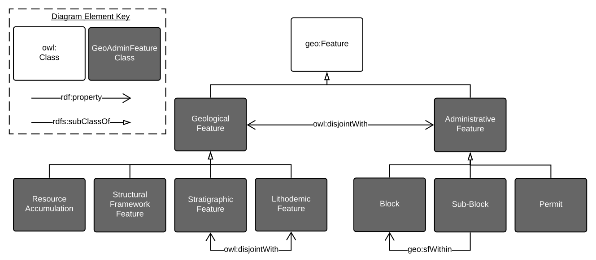

  

# GSQ Geo Admin Features Ontology
This ontology describes classes of geological and administrative Feature relevant to the duties of the Geological Survey of Queensland.

As subclasses of the GeoSPARQL Ontology's `Feature` class, this ontology defines `Geological Feature` and `Administrative Feature`. Multiple subclasses of those two main classes are also defined.

Most of the subclasses of `Geological Feature` defined here are not disjoint with other subclasses of it in recognition of the fact that a real-world Feature may be classed in multiple ways. `Administrative Feature` subclasses, however, are all disjoint having been defined disjointly by people.

References to and positioning of other Features defined elsewhere are made, such as placing the HY_Features model's `Catchment` and `CatchmentAggregate` classes as subclasses of this ontology's `Basin` class (a subclass of `Geological Feature`). As a result, the classes of object within the LocI project's [Geofabric dataset](http://linked.data.gov.au/dataset/geofabric))can be related to objects classified using this ontology.

## Online
This ontology will soon be visible online at its namespace URI location:

* <http://linked.data.gov.au/def/geoadminfeatures>

## Overview
At a high level, the classes of this ontology are shown in Figure 1.

**Figure 1**: A diagrammatic overview of the top-level classes in this ontology

## Details
This ontology contains detailed subclasses of some of its high-level classes. Currently, the two main areas of subclasses are:

1. `Structural Framework Feature`
2. `Basin`

Figure 3 shows the subclasses of `Structural Framework Feature` and Figure 4 shows subclasses of `Basin`, including hydrological basins from other ontologies.

**Figure 2**: Subclasses of the `Structural Framework Feature` class

**Figure 3**: Subclasses of the `Basin` class

## Repository Contents
This repository contains both the machine-readable ontology file in the RDF Turtle format, [geoadminfeatures.ttl](geoadminfeatures.ttl), and an HTML web page version of it for people to use [geoadminfeatures.html](geoadminfeatures.html). The HTML web page is generated semi-automatically from the RDF file and will soon be displayed online at this ontology's namespace location indicated above.

## License
The content of this API is licensed for use under the [Creative Commons 4.0 License](https://creativecommons.org/licenses/by/4.0/). See the [license deed](LICENSE) all details.

## Citation
If you wish to cite this profile, please do so like this:

Geological Survey of Queensland (2019) "Geo-Admin Features Ontology". An OWL ontology defining classes of geospatial Feature relevant to the duties of the Geological Survey of Queensland. http://linked.data.gov.au/def/gsq-features

## Contacts
*owner*:  
**Geological Survey of Queensland**  
*Within the Queensland Department of Natural Resources, Mines & Energy*  
1 William St, Brisbane, Queensland, Australia  
<https://www.business.qld.gov.au/industries/mining-energy-water/resources/geoscience-information/gsq>  
<GSQOpenData@dnrme.qld.gov.au>  

*author*:  
**Nicholas Car**  
SURROUND Australia Pty Ltd  
<nicholas.car@surroundaustralia.com>  
<http://orcid.org/0000-0002-8742-7730>  
