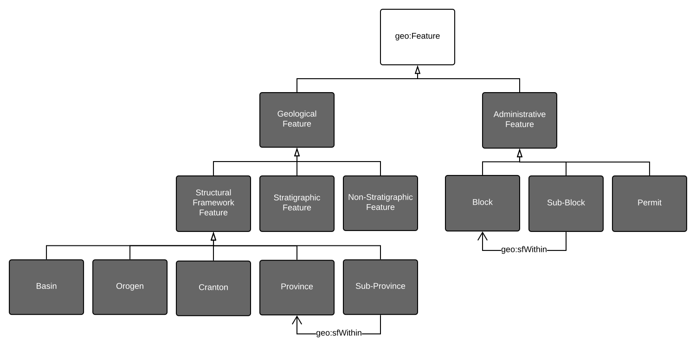

  

# GSQ Features Ontology
This Features Ontology describes classes of geospatial Feature relevant to the duties of the Geological Survey of Queensland. 

Within the GeoSPARQL Ontology's Feature class, here refered to as 'geospatial Feature', this ontology defines 'Geological Feature' and 'Administrative Feature'. Within those two main feature classes, a series of subclasses are defined.

Most of the subclasses of Geological Features defined here are not disjoint with other subclasses in recognition of the fact that a real-world Feature may be classed in multiple ways. Admininstrative Feature subclasses, however, are all disjoint having been defined disjointly by people.

## Online
This ontology will soon be visible online at its namespace URI location:

* <http://linked.data.gov.au/def/gsq-features>

**Figure 1**: a diagrammatic version of this ontology's model

## Repository Contents
This repository contains both the machein-readable ontology file in the RDF Turtle format, [gsq-features.ttl](gsq-features.ttl), and an HTML web page version of it for people to use [gsq-features.html](gsq-features.html). The HTML web page is generated semi-automatically from the RDF file and will soon be displayed online at this ontology's namespace location indicated above.

## License
The content of this API is licensed for use under the [Creative Commons 4.0 License](https://creativecommons.org/licenses/by/4.0/). See the [license deed](LICENSE) all details.

## Citation
If you wish to cite this profile, please do so like this:

Geological Survey of Queensland (2019) "GSQ Features Ontology". An OWL ontology defining classes of geospatial Feature relevant to the duties of the Geological Survey of Queensland. http://linked.data.gov.au/def/gsq-features

## Contacts
*owner*:  
**Geological Survey of Queensland**  
*Within the Queensland Department of Natural Resources, Mines & Energy*  
1 William St, Brisbane, Queensland, Australia  
<https://www.business.qld.gov.au/industries/mining-energy-water/resources/geoscience-information/gsq>  
<GSQOpenData@dnrme.qld.gov.au>  

*author*:  
**Nicholas Car**  
SURROUND Australia Pty Ltd  
<nicholas.car@surroundaustralia.com>  
<http://orcid.org/0000-0002-8742-7730>  
